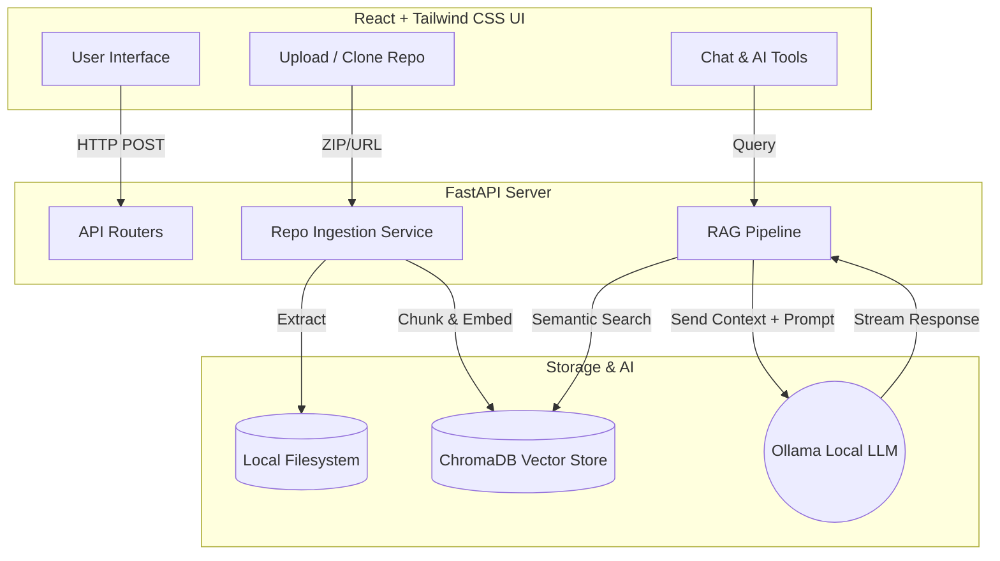

# CodeMind AI – Intelligent Codebase Assistant


**CodeMind AI** is a production-quality, fully local, open-source tool designed to supercharge your development workflow. It allows you to upload a ZIP file or clone a public GitHub repository, index its contents using locally-hosted embeddings, and interact with the codebase using Retrieval-Augmented Generation (RAG).

> **100% Free and Private:** CodeMind AI strictly uses open-source LLMs via Ollama. No data is ever sent to OpenAI, Claude, or any external API. Your code remains entirely on your machine.

---

## 🌟 Features

- **📂 Instant Repository Ingestion:** Upload any ZIP file or provide a GitHub URL to automatically clone, extract, and parse your project.
- **🧠 Local RAG Pipeline:** Uses ChromaDB for vector storage and semantic search to retrieve the exact code snippets necessary to answer your questions.
- **💬 AI Chat Interface:** Talk to your codebase naturally. Ask "Where is the authentication logic?" or "How does the database connection work?"
- **🔍 Code Review:** Paste a snippet or specify a file to receive automated, AI-driven code reviews focusing on best practices and security.
- **🏗 Architecture Explorer:** Automatically generate explanations of high-level module dependencies and system architecture.
- **📝 Documentation & README Generator:** Instantly generate Markdown documentation for undocumented files or full project READMEs.
- **🧪 Unit Test Suggestions:** Highlight a function and have the AI instantly write edge-case-covering unit tests in the appropriate framework.
- **🎨 Stunning UI:** A responsive, VS Code-inspired dark mode interface built with React and Tailwind CSS v4.

---

## 🏗 Architecture Diagram



---

## 🚀 Getting Started

### Prerequisites
1. **Python 3.8+**
2. **Node.js 18+**
3. **Ollama**: Download from [ollama.com](https://ollama.com/) and run `ollama run qwen2.5-coder` (or your preferred local model) to ensure the model is pulled to your machine.

### 1. Start the Backend
Navigate to the `backend` directory, activate your virtual environment, install dependencies, and start the FastAPI server:
```bash
cd backend
python -m venv venv

# Windows
.\venv\Scripts\Activate
# macOS/Linux
source venv/bin/activate

pip install -r requirements.txt
uvicorn app.main:app --reload
```
The API will be running at `http://localhost:8000`.

### 2. Start the Frontend
Open a **new terminal**, navigate to the `frontend` directory, install dependencies, and start Vite:
```bash
cd frontend
npm install
npm run dev
```
The beautiful UI will be running at `http://localhost:5173`.

### 🐳 Docker Deployment
If you have Docker and Docker Compose installed, you can launch the entire stack with a single command!

From the root of the project, run:
```bash
docker-compose up --build
```
This will automatically:
1. Build and start the FastAPI backend on port 8000.
2. Build and start the React/Nginx frontend on port 5173.
3. Automatically connect to your local Ollama instance (ensure Ollama is running on your host machine).
4. Persist your `repositories/` and `vector_db/` via Docker volumes so you don't lose your indexed code!

You can then access the app at `http://localhost:5173/`.

---

## 🛠 Tech Stack

**Frontend:**
- React (Vite)
- Tailwind CSS v4
- React Router DOM
- Axios
- Lucide React (Icons)
- React Markdown & Syntax Highlighter

**Backend:**
- Python FastAPI
- ChromaDB (Local Vector Store)
- Sentence-Transformers (`all-MiniLM-L6-v2` for embeddings)
- GitPython (For GitHub cloning)

**AI & Local Execution:**
- Ollama
- Qwen2.5-Coder (Recommended Model)

---

## 📜 License
This project is open-source and free to use. Built entirely with local LLMs to prioritize developer privacy.
